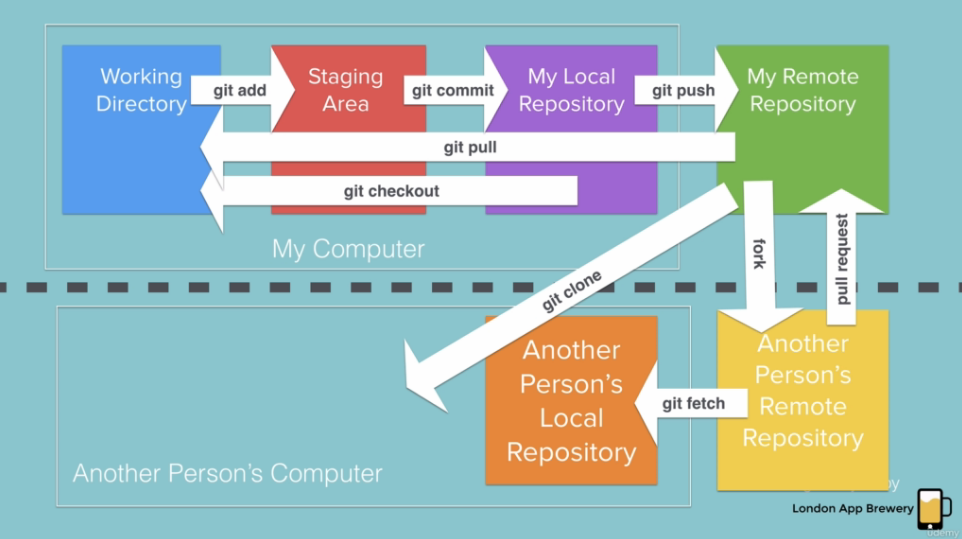

<h1> Git-Test </h1>
 
For Git Testing Purpose |  Not for Official use

1. git init
2. git add 
3. git status, git diff
3. git commit 
4. git commit -m ""
5. git log
6. git branch 
7. git checkout
8. git merge

<b> Git-Info </b>

$ after creating a pull request merge confirmation by the repo owmer is required to merge it to the
master branch

For more :
<b><a href="https://learngitbranching.js.org/"> Go here </a></b>
